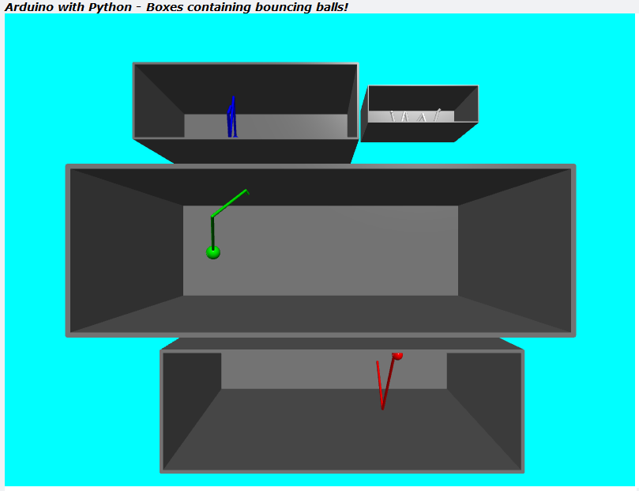

# TTB-AP-Lesson13
My Solution to Paul McWhorter's "Arduino with Python: LESSON 13" homework.

Visit Paul's video here:
 - https://youtu.be/watch?v=GFCk_JemuVA

You can get Paul's code here:
 - https://toptechboy.com/

You can see my solution demonstrated here:
 - https://youtu.be/KsSEriNPQtM

This week it is all about the python code and parametric design. I have drawn some boxes, or arenas, and in each one there is a ball bouncing around. All this essentially from 2 parameters, a box position and a box size. Everything else is relative.

## My Boxes with Bouncing Balls - Parameterised:

